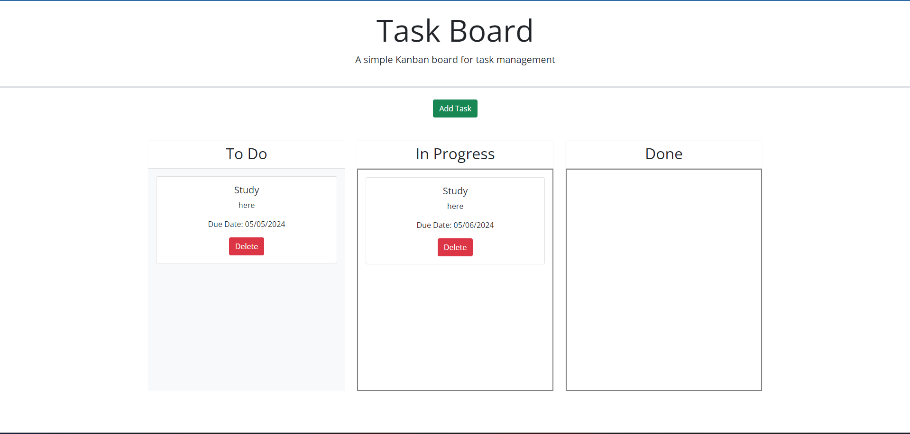

# Brian-Task-Board
## Description

Created a task board application to allow multiple tasks be applied and tracked in three different categories: to do, in progress, and done. Each task created can be manipulated and dragged to each category and dropped to allow proper tracking. Each task created includes the task name, description of the task, and due date by dropdown calendar and selecting the date necessary. Each task stays within the category placed by user and when page refreshes, categories still stay in place and are not deleted.  

## Link to Deployed Page
https://bds6575.github.io/Brian-Personal-Blog/